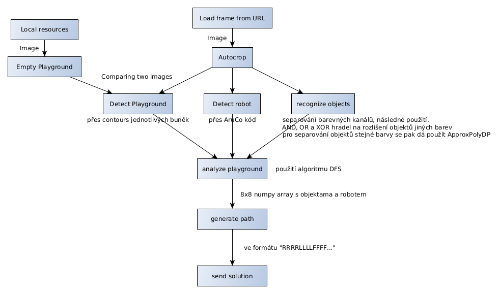
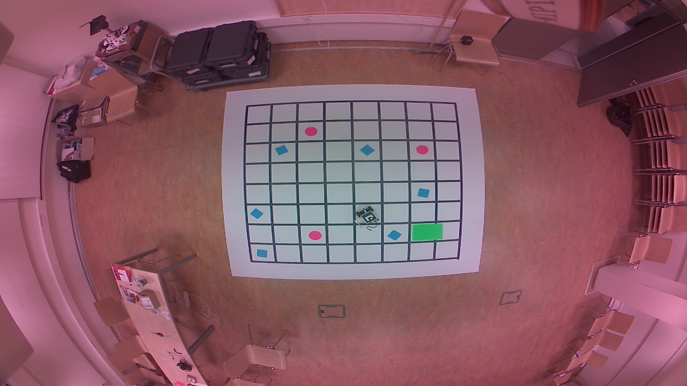
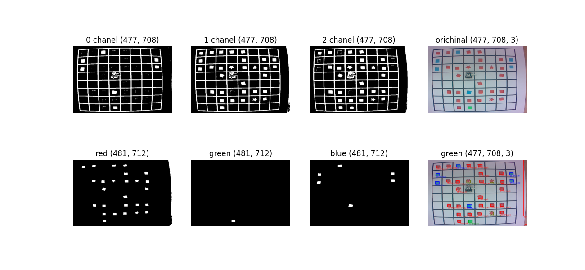
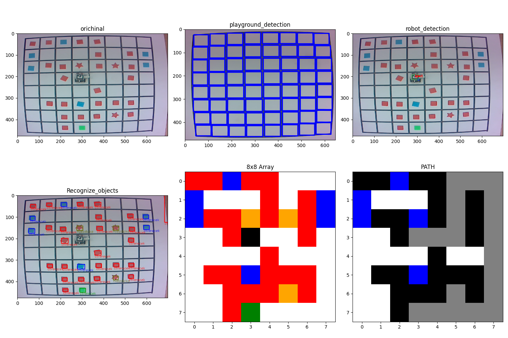

program se nastavuje buď přes terminál, nebo pomocí .json souboru.

Commandy přes terminál vypadají takhle:
(NOTE: k tomu abyste spouštěli main.py přes terminál, spusťte `chmod a+x main.py`)

# Explanation

## přes terminál

```
main.py --v
```

`--v` příkaz zapíná `verbose` mód, pro lepší debugging a okna v matplotlib

## přes .json

```
{
    "verbose": false,
    "testing": true,
    "resource": "/assets/image.png"
}
```

když je `resource` prázdný, tak se bere feed z URL, standartně je `resource` nastavený na `"/assets/image.png"`

# Diagram programu



# Jak vypadá hrací pole



# Output programu




